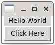

# EA1

## Package/Library Ovierview

### 1.Selected Package/Library
   The selected package/library is __Tkinter__.

### 2.What is Tkinter?
   Tkinter is a standard GUI(Graphical User Interface) toolkit in Python. It provides
a fast and easy way to create desktop applications with graphical interfaces[1].

#### Purpose:
   Tkinter serves the purpose of creating graphical user interfaces for Python
applications. It allows developers to create window, dialogs, buttons, menus, and
other GUI elements to build interactive applications[1,3].
   
#### Using:
   To use Tkinter, we need to import it into our Python script using __import tkinter__.
Then, we can create GUI elements like windows, frames, buttons, labels, and canvas using
various Tkinter classes and methods[1].
   The functions and commands that I use in my program:[2]
   1. __from tkinter import__: to imports all functions from the Tkinter module.
   2. __from tkinter import ttk__: to imports the themed widget which provides the tabs.
   3. __title()__: to sets the title of the main window.
   4. __ttk.Notebook()__: to creates a Notebook widget.
   5. __add(tab)__: to adds the tab frame.
   6. __Canvas()__: to creates a canvas widget, I used it to fill a colour in the tab.
   7. __fps__: to sets the frequency of the animation frame, I used it to control the
speed of the moving text.
   8. __shift()__: to start shifting of the animation.
   9. __canvas.create_text__: to creates a text object on the canvas.
   10. __Button()__: to creates a button widget.
   In summary, I use Tkinter to create a GUI application for displaying moving text and
allowing the users to edit the text. The application consists of two tabs: __Display__
and __Text__. In the __Display__ tab, a canvas displays a text ("Happy Valentine's Day!")
by default and the text moves horizontally across the screen. In the __Text__ tab, the
users can iput the new text using a multi-line text entry widget and click an __Edit__
button to update the displayed text on the canvas.
   The application utilizes Tkinter's __Canvas__, __Notebook__, __Frame__, __Text__, and
 __Button__ widgets for the user interface components.

### 3.Functionalities of Tkinter:
   + Creating windows and frames
   + Adding buttons, labels, text entry widgets, and other GUI elements
   + Handling user events like button clicks and key presses
   + Drawing graphics with the Canvas widgets
   + Building menu bars and context menus
   + Organizing widgets using layout managers like grid, pack, and place
   
 __Example:__
 
```python
import tkinter as tk

root = tk.Tk()
root.title("Example")

# Creating a label
label = tk.Label(root, text="Hello World")
label.pack()

# Creating a button
button = tk.Button(root, text="Click Here")
button.pack()

root.mainloop()
```
 __Output:__
 


### 4.Create Date
   Tkinter has been part of Python's standard library since the early versions of Python.
It has been actively developed and maintained over the years[3].

### 5.Why Tkinter?
   Tkinter is selected because it is a built-in library, making it readily available for
all Python installations without the need for additional installations. Additionally,
Tkinter provides a simple and easy-to-use interface for creating GUI applications,
making it suitable for beginners.

### 6.Influence on Learning
   Learning Tkinter has provided insights into GUI development in Python and enhanced
understanding of event-driven programming concepts. It has expanded my skills in building
interactive applications and provided a foundation for exploring other GUI libraries.

### 7.Overall Experience
   Tkinter offers a smooth learning curve and comprehensive documentation, making it easy
to get started with GUI development in Python. I would recommend Tkinter to beginners
and anyone who looking for a simple solution for creating desktop applications.
   Personally, I would continue using Tkinter for projects requiring simple to moderate
complexity GUIs due to its reliability and ease of use. However, for more advanced and
feature-rich applications, exploring other GUI libraries might be necessary. 
   
## References:
  [1] https://docs.python.org/3/library/tkinter.html
  [2] https://www.tutorialspoint.com/python/python_gui_programming.htm
  [3] https://subscription.packtpub.com/book/programming/9781788835886/1/ch01lvl1sec10/introducing-tkinter-and-tk

